# Windows 10 to Windows 11 Upgrade Lab — Logbook

## 2026-07-03 — Part 1: Project setup

### Goal

Create the documentation structure for the Windows 10 to Windows 11 Upgrade Lab.

### Work completed

* Created the main project folder.
* Created documentation folders.
* Created `README.md`.
* Created `logbook.md`.
* Created `.gitkeep` files so Git can track empty folders.
* Opened the project in VS Code.
* Prepared the lab for step-by-step documentation.

### Commands used

```powershell
cd C:\Users\*****
mkdir Windows-10-to-11-Upgrade-Lab
cd Windows-10-to-11-Upgrade-Lab

mkdir docs
mkdir screenshots
mkdir results
mkdir notes

New-Item README.md
New-Item logbook.md
New-Item docs\.gitkeep
New-Item screenshots\.gitkeep
New-Item results\.gitkeep
New-Item notes\.gitkeep

code .
```

### Command purpose

| Command | Purpose |
| --- | --- |
| `cd C:\Users\*****` | Moves PowerShell to the user folder. |
| `mkdir Windows-10-to-11-Upgrade-Lab` | Creates the main project folder. |
| `cd Windows-10-to-11-Upgrade-Lab` | Moves into the project folder. |
| `mkdir docs` | Creates the documentation folder. |
| `mkdir screenshots` | Creates the screenshot evidence folder. |
| `mkdir results` | Creates the command output and result folder. |
| `mkdir notes` | Creates the troubleshooting notes folder. |
| `New-Item README.md` | Creates the main project overview file. |
| `New-Item logbook.md` | Creates the step-by-step project logbook. |
| `New-Item .gitkeep` | Creates placeholder files so Git can track empty folders. |
| `code .` | Opens the project folder in VS Code. |

### Evidence

Screenshot:

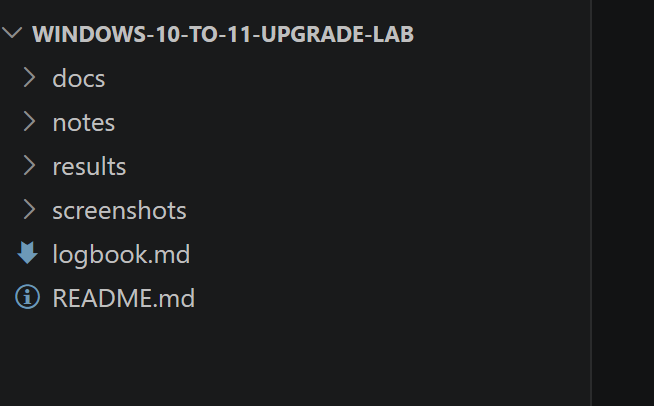

---

## 2026-07-03 — Part 2: Windows 10 ISO preparation

### Goal

Download and prepare a Windows 10 ISO for use in VMware.

### Work completed

* Downloaded the Windows 10 ISO with the Microsoft Media Creation Tool.
* Located the ISO after download.
* Reviewed the ISO folder.
* Identified that other ISO files in the folder were not Windows 10.
* Verified that the Windows Server ISO was not the correct Windows 10 file.
* Copied the Windows 10 ISO from OneDrive to a local ISO folder.
* Renamed the ISO to a clear lab filename.
* Confirmed VMware detected the ISO as Windows 10 x64.

### ISO files reviewed

| File | Result |
| --- | --- |
| `SERVER_EVAL_x64FRE_en-us.iso` | Windows Server evaluation ISO, not used |
| `rhel-10.1-x86_64-dvd.iso` | Red Hat Enterprise Linux ISO, not used |
| `Win11_25H2_EnglishInternational_x64_v2.iso` | Windows 11 ISO, kept for later upgrade |
| `Win10_22H2_English_x64.iso` | Windows 10 ISO, used for this lab |

### Commands used

```powershell
Get-ChildItem "C:\Users\*****\Documents\ISO" | Select-Object Name,Length,LastWriteTime

Get-ChildItem "C:\Users\*****" -Filter *.iso -Recurse -ErrorAction SilentlyContinue |
Select-Object FullName,Length,LastWriteTime

Copy-Item "C:\Users\*****\OneDrive\Dokument\Windows.iso" "C:\Users\*****\Documents\ISO\Win10_22H2_English_x64.iso"

Get-ChildItem "C:\Users\*****\Documents\ISO" | Select-Object Name,Length,LastWriteTime
```

### Command purpose

| Command | Purpose |
| --- | --- |
| `Get-ChildItem` | Lists files in a folder. |
| `Select-Object Name,Length,LastWriteTime` | Shows file name, file size and modified time. |
| `-Filter *.iso` | Searches only for ISO files. |
| `-Recurse` | Searches through subfolders. |
| `-ErrorAction SilentlyContinue` | Hides permission errors during searching. |
| `Copy-Item` | Copies the Windows ISO from OneDrive to a local ISO folder. |

### Result

The Windows 10 ISO was prepared and ready for VMware.

---

## 2026-07-03 — Part 3: VMware VM creation

### Goal

Create a VMware virtual machine for the Windows 10 to Windows 11 upgrade lab.

### Work completed

* Created a new VMware virtual machine.
* Selected the Windows 10 ISO.
* Confirmed VMware detected Windows 10 x64.
* Named the VM `Win10-to-Win11-Upgrade-Lab`.
* Set the VM location outside OneDrive.
* Set the virtual disk to 80 GB.
* Used split virtual disk files.
* Increased memory from 2 GB to 8 GB.
* Configured 2 CPU cores.
* Confirmed NAT networking.
* Enabled UEFI firmware.
* Enabled Secure Boot.
* Encrypted TPM support files.
* Added a virtual Trusted Platform Module.

### Final VM settings

| Setting | Value |
| --- | --- |
| VM name | Win10-to-Win11-Upgrade-Lab |
| Location | `C:\VirtualMachines` |
| Operating system | Windows 10 x64 |
| Firmware | UEFI |
| Secure Boot | Enabled |
| TPM | Present |
| Memory | 8 GB |
| CPU | 2 cores |
| Disk | 80 GB |
| Network | NAT |
| CD/DVD | Windows 10 ISO |

### Result

The VM was configured for Windows 10 installation and future Windows 11 upgrade compatibility.

---

## 2026-07-03 — Part 4: Windows 10 installation

### Goal

Install Windows 10 Pro in the VMware virtual machine.

### Work completed

* Booted the VM from the Windows 10 ISO.
* Started Windows Setup.
* Installed Windows 10 to the 80 GB virtual disk.
* Selected Sweden as the region.
* Used a local/offline account instead of a personal Microsoft account.
* Created a generic lab user named `LabUser`.
* Completed Windows first-time setup.
* Reached the Windows 10 desktop.

### Installation choices

| Step | Selection |
| --- | --- |
| Region | Sweden |
| Account type | Offline/local account |
| Lab username | LabUser |
| Edition | Windows 10 Pro |
| Install type | Custom install |
| Disk | 80 GB virtual disk |

### Result

Windows 10 Pro was installed successfully.

---

## 2026-07-03 — Part 5: Windows 10 baseline verification

### Goal

Verify the installed Windows 10 system baseline before preparing for the Windows 11 upgrade.

### Work completed

* Ran `winver`.
* Confirmed Windows 10 Pro 22H2, OS Build 19045.3803.
* Reviewed system information with `systeminfo`.
* Verified TPM status with `Get-Tpm`.
* Verified Secure Boot with `Confirm-SecureBootUEFI`.
* Verified disk space with `Get-PSDrive C`.
* Verified CPU and memory with `Get-ComputerInfo`.
* Verified network connectivity with `Test-NetConnection`.

### Commands used

```powershell
winver
systeminfo
Get-Tpm
Confirm-SecureBootUEFI
Get-PSDrive C
Get-ComputerInfo | Select-Object CsProcessors,CsNumberOfLogicalProcessors,CsTotalPhysicalMemory
Test-NetConnection microsoft.com -CommonTCPPort HTTP
```

### Command purpose

| Command | Purpose |
| --- | --- |
| `winver` | Opens the About Windows dialog and shows Windows edition, version and build number. |
| `systeminfo` | Shows detailed Windows system information. |
| `Get-Tpm` | Checks whether Windows detects a Trusted Platform Module. |
| `Confirm-SecureBootUEFI` | Confirms whether Secure Boot is enabled in UEFI mode. |
| `Get-PSDrive C` | Shows used and free space on the C: drive. |
| `Get-ComputerInfo` | Shows Windows computer hardware and configuration details. |
| `Select-Object` | Filters command output to show only selected fields. |
| `Test-NetConnection` | Tests network connectivity to a remote host and port. |

### Evidence

Screenshots:

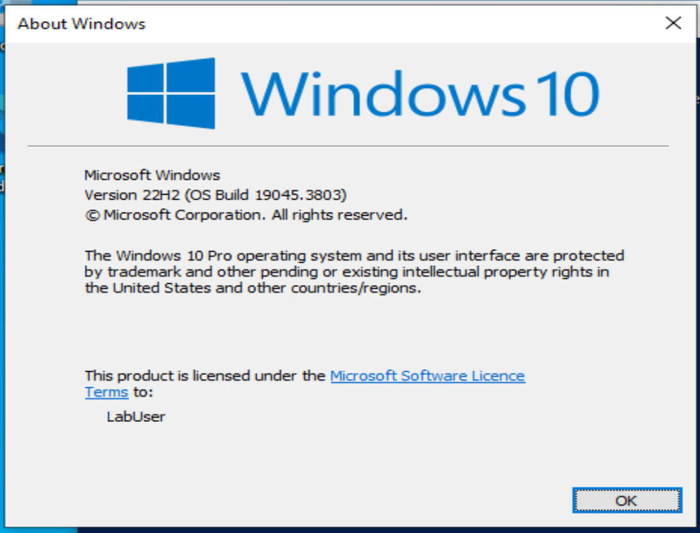

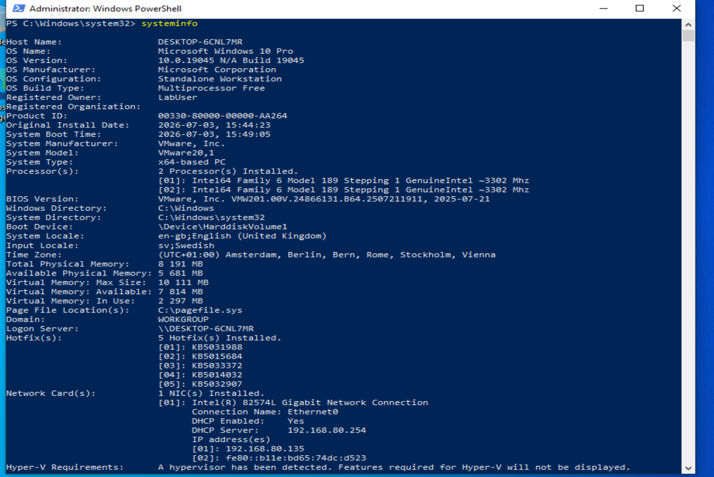

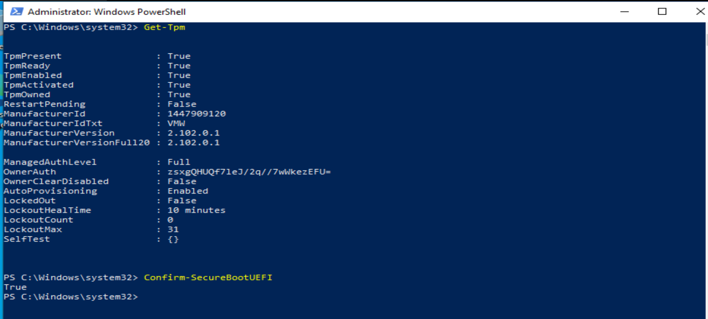

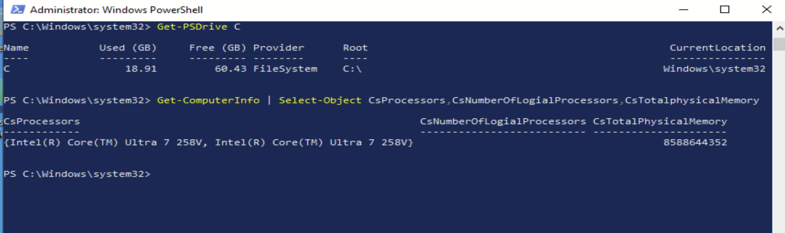

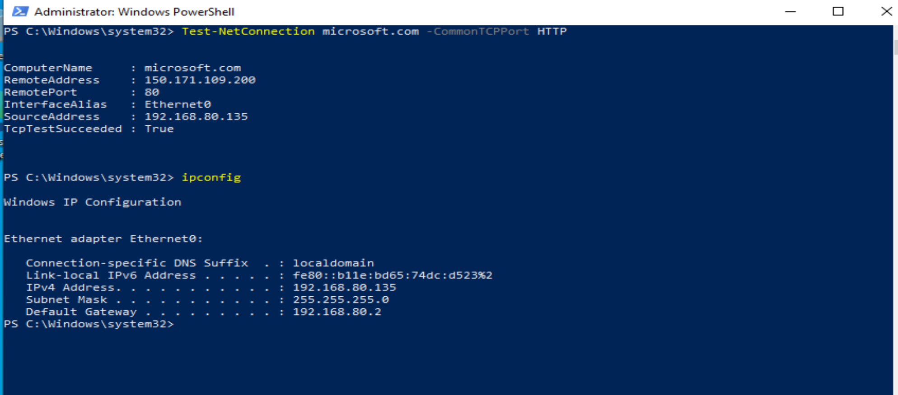

### Result

Windows 10 baseline checks were completed successfully.

---

## 2026-07-03 — Part 6: VMware Tools installation

### Goal

Install and verify VMware Tools inside the Windows 10 VM.

### Work completed

* Started VMware Tools installation from the VMware Workstation `VM` menu.
* Mounted the VMware Tools installation media inside the Windows 10 VM.
* Installed VMware Tools.
* Restarted the VM after installation.
* Verified the VMware Tools service with `Get-Service VMTools`.

### Command used

```powershell
Get-Service VMTools
```

### Command purpose

| Command | Purpose |
| --- | --- |
| `Get-Service VMTools` | Checks whether the VMware Tools service exists and whether it is running. |

### Verification result

| Item | Result |
| --- | --- |
| Service name | VMTools |
| Display name | VMware Tools |
| Status | Running |

### Evidence

Screenshots:

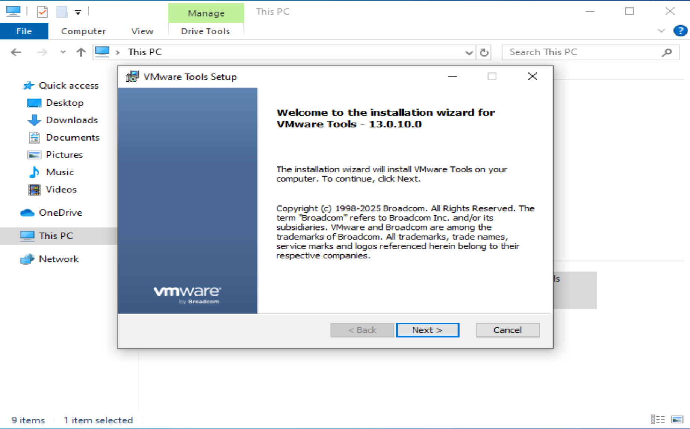

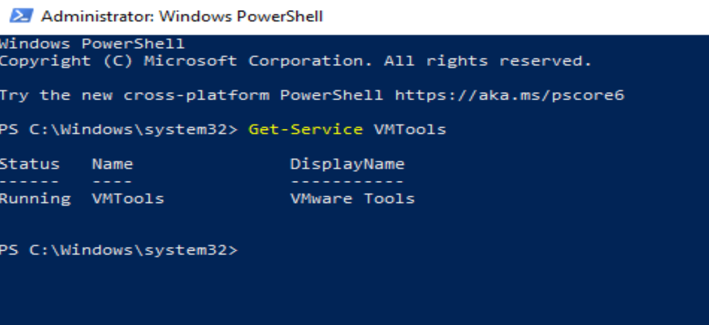

### Result

VMware Tools was installed successfully and verified as running.

---

## 2026-07-03 — Part 7: Windows Update preparation

### Goal

Check Windows Update before starting the Windows 11 upgrade.

### Work completed

* Opened Windows Update in the Windows 10 VM.
* Captured the Windows Update status before a manual update check.
* Ran a manual update check.
* Observed Windows Update downloading security and quality updates.
* Observed Windows 10 reporting an end-of-support/missing-fixes status after update checks.

### Notes

The Windows 10 end-of-support status supports the business reason for upgrading to Windows 11.

### Evidence

Screenshots:

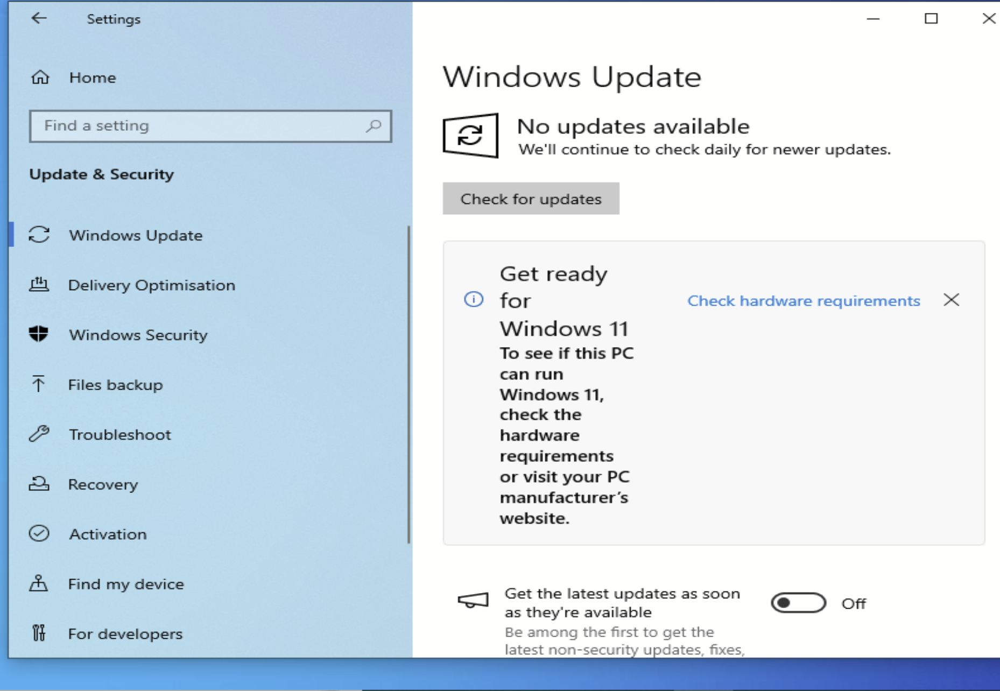

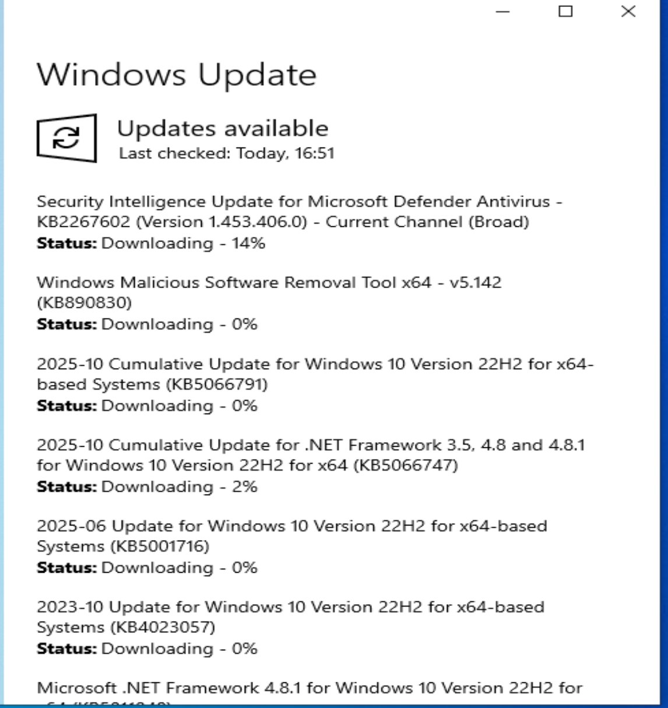

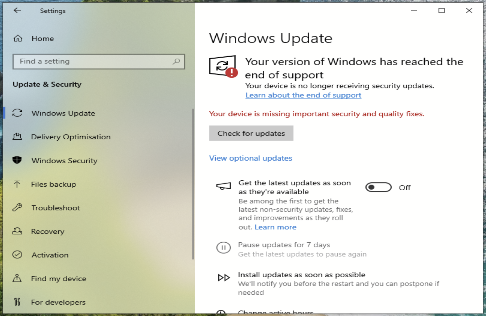

### Result

Windows Update preparation was completed.

---

## 2026-07-03 — Part 8: Pre-upgrade snapshot

### Goal

Create a rollback point before starting the Windows 11 upgrade.

### Work completed

* Created a VMware snapshot before the Windows 11 upgrade.
* Named the snapshot `Before Windows 11 Upgrade`.
* Verified the snapshot in VMware Snapshot Manager.

### Snapshot details

| Field | Detail |
| --- | --- |
| Snapshot name | Before Windows 11 Upgrade |
| Purpose | Rollback point before Windows 11 upgrade |
| VM state | Windows 10 Pro baseline with VMware Tools installed and update checks completed |

### Evidence

Screenshots:

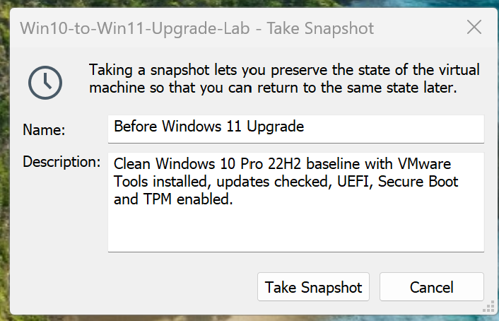


### Result

A pre-upgrade rollback point was created successfully.

---

## 2026-07-03 — Part 9: Windows 11 upgrade and verification

### Goal

Perform an in-place upgrade from Windows 10 Pro to Windows 11 Pro and verify the result.

### Work completed

* Attached the Windows 11 ISO to the VM.
* Opened the mounted ISO inside Windows 10.
* Started the upgrade with `setup.exe`.
* Chose the setup path that keeps personal files and apps.
* Confirmed Windows Setup was ready to install Windows 11 Pro.
* Completed the Windows 11 in-place upgrade.
* Verified the upgraded Windows version with `winver`.
* Verified Windows build information with PowerShell.
* Verified TPM and Secure Boot after upgrade.
* Checked Device Manager after upgrade.
* Checked Windows Update after upgrade.
* Confirmed required updates completed after upgrade.

### Upgrade method

The upgrade was started from inside Windows 10 by running:

```text
setup.exe
```

from the mounted Windows 11 ISO.

This was an in-place upgrade, not a clean install.

### Setup confirmation

| Item | Selection |
| --- | --- |
| Target operating system | Windows 11 Pro |
| Files and apps | Keep personal files and apps |

### Commands used

```powershell
winver

Get-ComputerInfo | Select-Object WindowsProductName,WindowsVersion,OsBuildNumber

Get-Tpm

Confirm-SecureBootUEFI
```

### Command purpose

| Command | Purpose |
| --- | --- |
| `winver` | Opens the Windows version dialog and verifies the installed Windows version. |
| `Get-ComputerInfo` | Shows Windows system information from PowerShell. |
| `Select-Object WindowsProductName,WindowsVersion,OsBuildNumber` | Filters Windows version output to product name, version and build number. |
| `Get-Tpm` | Verifies TPM status after the upgrade. |
| `Confirm-SecureBootUEFI` | Verifies Secure Boot after the upgrade. |

### Verification result

| Item | Result |
| --- | --- |
| Upgrade result | Completed |
| Upgrade type | In-place upgrade |
| Target edition | Windows 11 Pro |
| Personal files and apps | Kept |
| OS build shown in PowerShell | 26200 |
| TPM | Present and ready |
| Secure Boot | Enabled |
| VMware Tools | Running |
| Windows Update | Required updates completed |

### Notes

The PowerShell output showed `WindowsProductName` as `Windows 10 Pro` while also showing build `26200`.

This can happen because some Windows compatibility fields may still use Windows 10 naming internally after upgrade.

For this lab, `winver` and OS build information are used as the primary Windows 11 verification evidence.

Windows Update later showed the Windows 11 VM as up to date, with an optional preview update available.

The optional preview update was not required for this lab.

### Evidence

Screenshots:

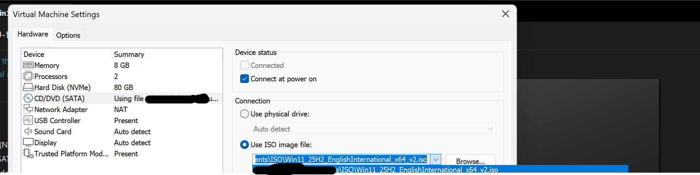

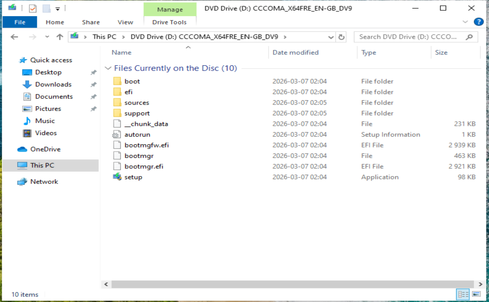

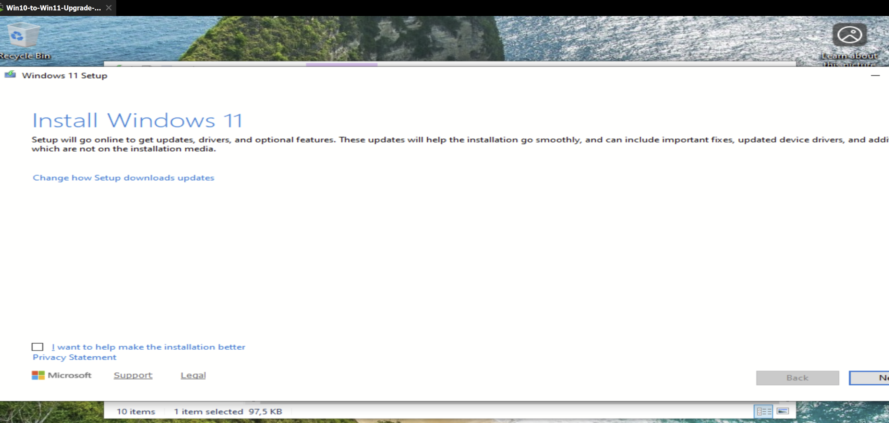

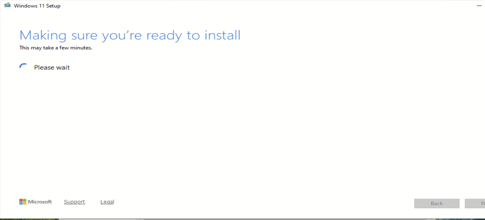

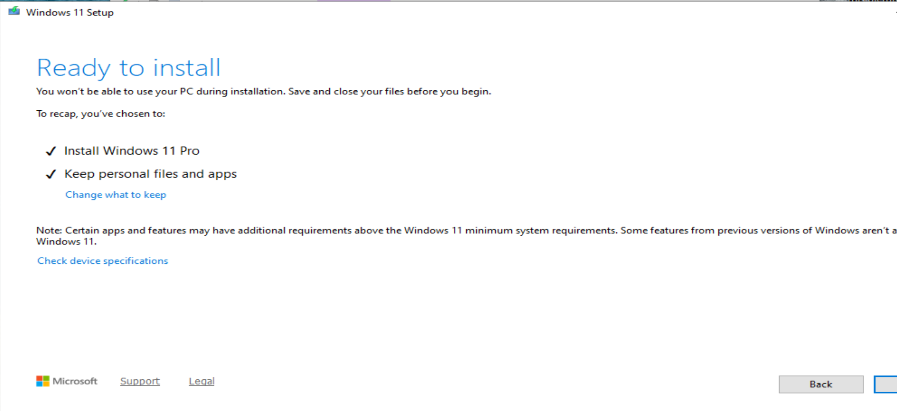

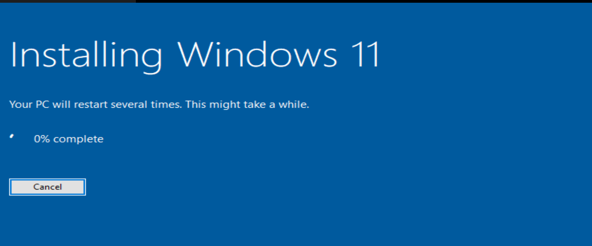

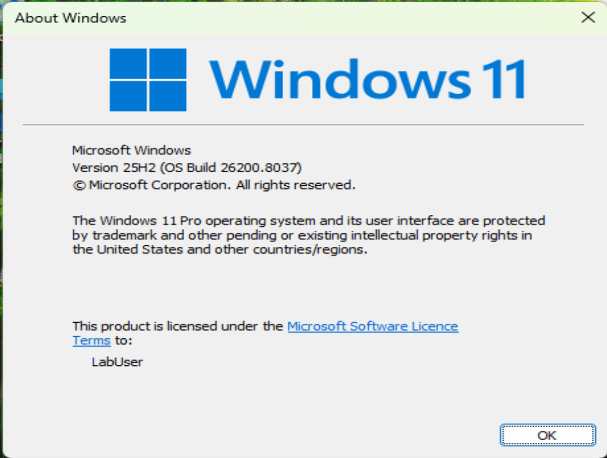

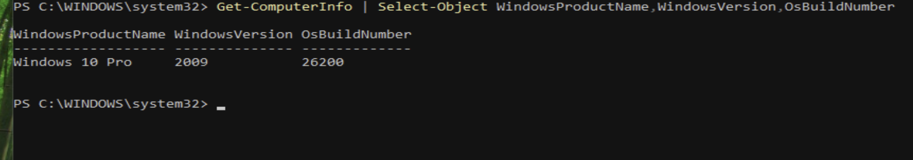

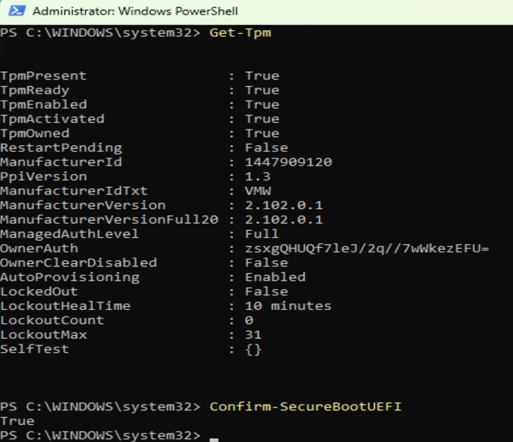

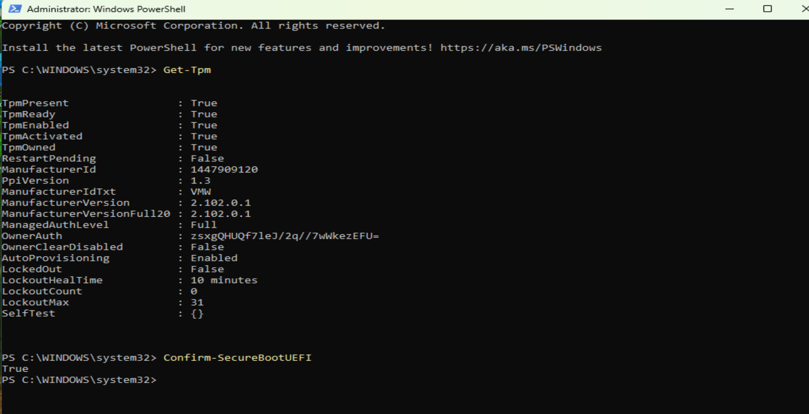

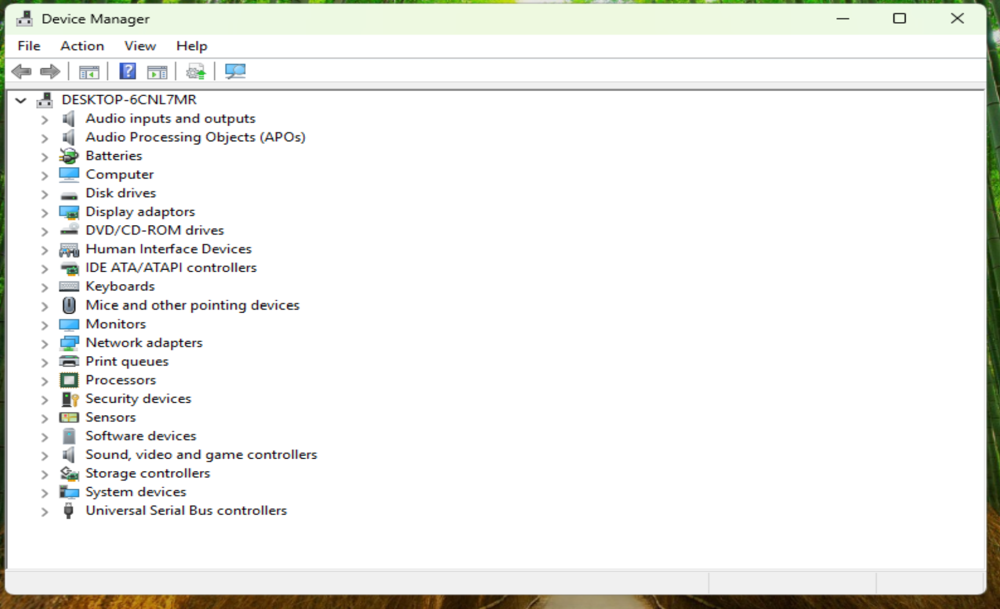

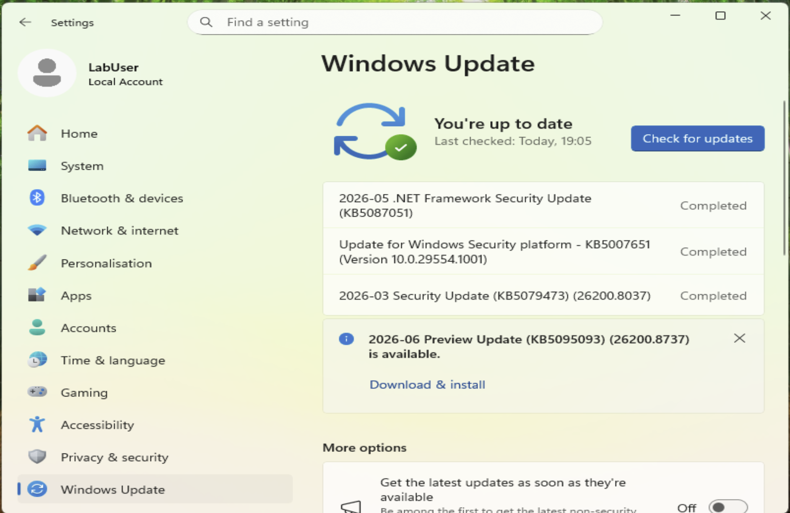

### Result

The Windows 10 Pro VM was successfully upgraded to Windows 11 Pro.

The upgrade preserved the local lab account and kept personal files and apps.

Post-upgrade checks confirmed TPM, Secure Boot, Windows Update and Device Manager status.

The VM is ready for final documentation review, troubleshooting notes and GitHub polish.

---

## 2026-07-03 — Part 10: Upgrade troubleshooting notes

### Goal

Create troubleshooting notes for common Windows 10 to Windows 11 upgrade issues.

### Work completed

* Created `notes/windows-11-upgrade-troubleshooting.md`.
* Documented common TPM-related upgrade problems.
* Documented Secure Boot and UEFI issues.
* Documented disk space problems.
* Documented Windows Update troubleshooting.
* Documented VMware Tools verification.
* Documented network test behavior, including ping timeout vs TCP connectivity.
* Documented setup path issues, including the difference between in-place upgrade and clean install.
* Documented the optional preview update decision after upgrade.

### Troubleshooting topics covered

| Topic | Purpose |
| --- | --- |
| TPM not detected | Explains checks and VMware virtual TPM setup. |
| Secure Boot not enabled | Explains Secure Boot verification and VMware setting. |
| BIOS instead of UEFI | Explains why UEFI should be configured before installation. |
| Not enough disk space | Explains disk checks and cleanup options. |
| Windows Update stuck | Lists basic restart, disk and network checks. |
| Ping fails but internet works | Explains ICMP blocking and TCP testing. |
| VMware Tools not detected | Explains service verification and reinstall path. |
| Version fields look confusing | Explains why some PowerShell fields may still show Windows 10 naming. |
| Setup wants to keep nothing | Explains why setup should be started from inside Windows 10. |
| Windows 11 ISO not mounted | Explains CD/DVD ISO checks in VMware. |
| Optional preview update appears | Explains why optional previews were skipped. |

### Evidence

Troubleshooting document:

```text
notes/windows-11-upgrade-troubleshooting.md
```

### Result

A troubleshooting reference was created for common Windows 11 upgrade support scenarios.

---

## 2026-07-03 — Part 11: Final report and GitHub polish

### Goal

Create the final report and prepare the project for portfolio use.

### Work completed

* Created `docs/windows-10-to-11-upgrade-final-report.md`.
* Summarized the project purpose, scope and lab environment.
* Summarized the Windows 10 source system.
* Summarized the Windows 11 target system.
* Documented the preparation process.
* Documented the in-place upgrade method.
* Documented verification commands and evidence.
* Documented troubleshooting observations.
* Updated the README to show the project as complete.
* Updated the logbook with final troubleshooting and report sections.
* Prepared the repository for final GitHub review.

### Final project documents

| Document | Purpose |
| --- | --- |
| `README.md` | Main project overview |
| `logbook.md` | Full step-by-step lab record |
| `docs/windows-10-to-11-upgrade-final-report.md` | Final upgrade report |
| `notes/windows-11-upgrade-troubleshooting.md` | Troubleshooting reference |

### Final verification checklist

* README opens correctly on GitHub.
* Logbook opens correctly on GitHub.
* Final report link works.
* Troubleshooting notes link works.
* Screenshot references match files in the `screenshots` folder.
* Written documentation uses anonymized local paths where needed.
* No real passwords, private account data, license keys or company data are documented.

### Result

The Windows 10 to Windows 11 Upgrade Lab was completed and polished for GitHub portfolio use.
